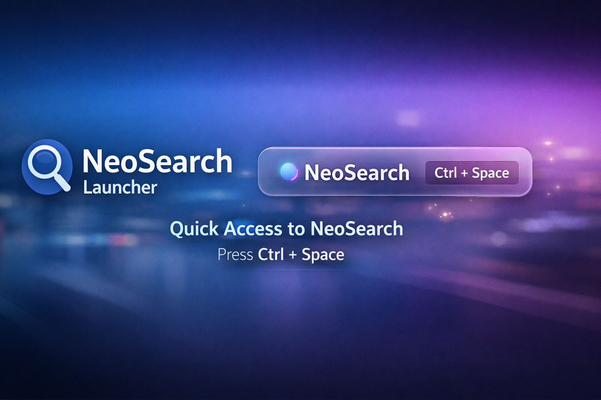

<div align="center">
  
  <h1>NeoSearch Launcher for Seelen</h1>
  <p>
    <strong>Launcher natif Windows (Tauri v2)</strong> avec recherche intelligente, UI premium et widget Seelen prêt à publier.
  </p>
  <p>
    
    
    
    
  </p>
</div>

---

## Pourquoi NeoSearch

NeoSearch est une barre de recherche desktop orientée **vitesse** et **productivité**:

- Recherche locale d'apps Windows (Start Menu + apps système).
- Ranking intelligent (exact/prefix/fuzzy/acronymes/multi-termes + boost d'usage).
- Commandes rapides web: `g`, `yt`, `gh`.
- Calcul rapide: `=` (copie du résultat au presse-papiers).
- UI moderne type launcher, optimisée clavier.

## Démo des commandes

```text
g wallpaper 4k       -> recherche Google
yt lofi hip hop      -> recherche YouTube
gh tauri plugin      -> recherche GitHub
= (18*7)+2           -> calcul instantané
```

## Stack technique

- **Frontend**: HTML/CSS/JS vanilla (léger et rapide)
- **Desktop app**: Tauri v2 + Rust
- **Global shortcut**: `Ctrl+Space` (fallback non bloquant si déjà pris)
- **Widget Seelen**: manifest YAML prêt à intégrer

## Structure du projet

```text
src/
  index.html
  style.css
  app.js
src-tauri/
  src/lib.rs
  tauri.conf.json
neo-search-launcher.yaml
```

## Lancer en développement

### Prérequis

- Node.js 20+
- Rust (cargo/rustc)
- Outils Tauri Windows (WebView2, Build Tools, etc.)

### Commandes

```bash
npm install
npm run dev
```

## Build production (EXE + Installers)

### Build standard

```bash
npm run build
```

### Build explicite des bundles

```bash
npm run tauri -- build --bundles nsis,msi
```

### Artefacts attendus

- `src-tauri/target/release/neo-search-v3.exe`
- `src-tauri/target/release/bundle/nsis/NeoSearch_3.0.0_x64-setup.exe`
- `src-tauri/target/release/bundle/msi/NeoSearch_3.0.0_x64_en-US.msi`

## Intégration Seelen

Le widget est fourni ici:

- `neo-search-launcher.yaml`

Ce manifest inclut:

- `id` + `metadata` + `settings` + `html/css/js`
- un bouton pour lancer NeoSearch
- une logique de détection d'emplacements d'installation Windows courants

## Publication GitHub / Releases

Pour une release propre:

1. Build `nsis` + `msi`.
2. Uploader les artefacts dans **GitHub Releases**.
3. (Optionnel) tag versionné `v3.0.0`.

## Licence

Ce projet est distribué sous licence **Apache 2.0**.  
Voir [LICENSE](./LICENSE).

